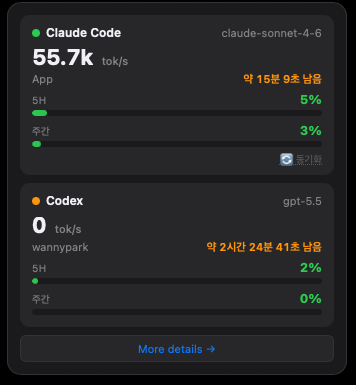
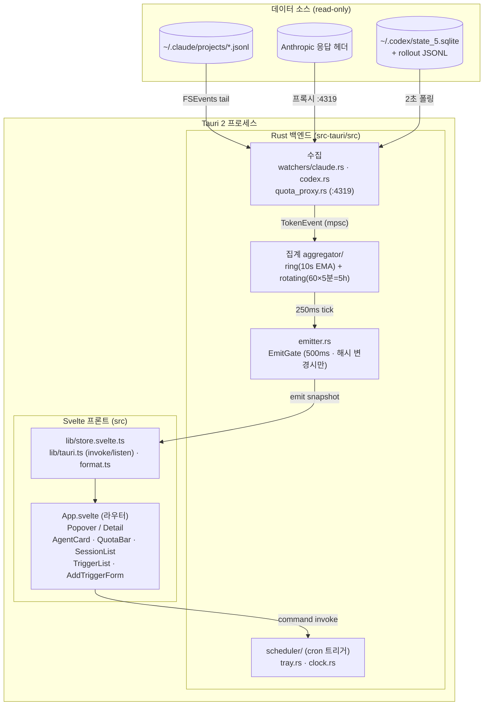
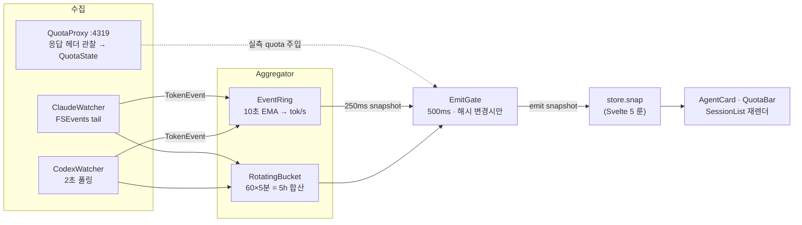
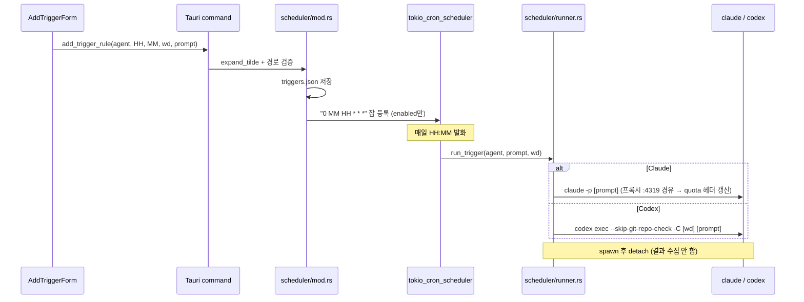

# AI Agent Monitor

> Claude Code와 Codex의 토큰 사용량을 상태 바에서 실시간으로 모니터링하는 네이티브 앱

[](https://github.com/manaes/AIAgentMonitor/releases)
[](#설치)
[](#)

---

## 스크린샷

| 상태 바 팝업 | 세부 대시보드 |
|---|---|
|  |  |

---

## 주요 기능

### 📊 실시간 토큰 모니터링
- **tok/s** — 현재 AI 응답 속도 (10초 EMA)
- **5h 사용량 바** — 실측 사용률(%) 자동 표시
- **주간(7d) 사용량 바** — 주간 사용률 별도 표시
- **리셋 카운트다운** — "약 X시간 Y분 Z초 남음" 실시간 표시
- **활성 세션 목록** — 프로젝트별 / 모델별 분리 (Active/Idle/Dormant)

### 🎯 실측 사용량 자동 동기화
- **Claude Code**: 앱 시작 시 및 10분마다 자동으로 `claude -p "ping"`을 내부 프록시(포트 4319) 경유로 실행해 Anthropic 서버가 응답 헤더로 보내는 5h/주간 사용률과 리셋 시각을 캡처합니다. 수동 동기화 버튼도 제공.
- **Codex**: 세션 rollout JSONL의 `rate_limits` 필드에서 5h/주간 사용률과 리셋 시각을 자동으로 읽습니다.

### ⏰ Anchor Trigger
정해진 시각에 자동으로 가벼운 프롬프트를 발사해 5h quota window의 reset 타이밍을 생활 패턴(점심/퇴근)에 고정합니다.

예) 08:00에 ping → 13:00/18:00에 reset

---

## 설치

### 다운로드 (권장)

[**최신 릴리즈 다운로드 →**](https://github.com/manaes/AIAgentMonitor/releases/latest)

| 플랫폼 | 파일 |
|---|---|
| macOS Apple Silicon | `AI.Agent.Monitor_*_aarch64.dmg` |
| macOS Intel | `AI.Agent.Monitor_*_x64.dmg` |
| Windows | `AI.Agent.Monitor_*_x64_en-US.msi` |

**macOS 첫 실행 시** Gatekeeper 경고가 뜨면:
```bash
xattr -cr "/Applications/AI Agent Monitor.app"
```
또는 시스템 설정 → 개인 정보 보호 및 보안 → 앱 허용

---

## 사용 방법

### 기본 사용

1. 앱 실행 → 상단 상태 바에 아이콘 표시
2. **아이콘 클릭** → Detail 창 열기 (Sessions / Triggers 탭)
3. **우클릭** → Open Log Folder / Quit

### 사용량 자동 동기화

앱이 시작되면 5초 후 자동으로 사용량을 동기화합니다. 이후 Claude를 사용하는 동안 10분마다 자동 갱신됩니다.

즉시 갱신하려면 Detail 창 에이전트 카드의 **🔄 동기화** 버튼을 클릭하세요.

### Anchor Trigger 사용

1. Detail 창 → **Triggers** 탭
2. **새 트리거 추가**: 에이전트 / 실행 시각(HH:MM) / 작업 디렉토리 / 프롬프트 입력
3. 📁 버튼으로 폴더 선택 가능
4. **▶ 지금 실행** 버튼으로 즉시 테스트

---

## 데이터 소스

| 소스 | 접근 방식 | 데이터 |
|---|---|---|
| Claude Code | `~/.claude/projects/*/*.jsonl` FSEvents tail | 토큰 (in/out/cache), 세션, 모델 |
| Claude Code | 내부 프록시(포트 4319) 경유 자동 핑 | 실측 5h/주간 사용률, 리셋 시각 |
| Codex | `~/.codex/state_5.sqlite` → rollout JSONL | 토큰 delta, 실측 5h/주간 사용률 |

모든 접근은 **read-only** 또는 로컬 프록시이며 외부 서버로 데이터가 전송되지 않습니다.

---

## 동작 원리 (아키텍처)

**Tech Stack**: Tauri 2 · Rust (tokio, notify, rusqlite, axum, tokio-cron-scheduler) · Svelte 5 · TypeScript

### 1. 시스템 토폴로지

하나의 Tauri 2 프로세스 안에서 **Rust 백엔드(데이터 수집·집계)** 와 **Svelte 5 프론트엔드(렌더)** 가 IPC 로 연결된다. 창은 `popover`(상태 바 팝업)·`detail`(대시보드) 둘이며, 같은 `snapshot` 이벤트를 함께 구독한다.



### 2. 데이터 흐름 (단방향)



1. **수집** — `ClaudeWatcher` 는 FSEvents 로 jsonl 을 tail-follow 하며 `assistant` 메시지의 usage·model·timestamp 를 `TokenEvent` 로, `CodexWatcher` 는 2초마다 `state_5.sqlite`(read-only WAL)에서 활성 스레드를 찾아 rollout JSONL 의 `token_count`·`rate_limits` 를 읽어 같은 채널로 보낸다. `QuotaProxy` 는 `127.0.0.1:4319` 에서 Claude 요청을 그대로 Anthropic 으로 포워딩하면서 `anthropic-ratelimit-unified-5h/7d-*` 헤더만 관찰해 `QuotaState` 로 적재한다.
2. **집계** — `Aggregator` 가 `TokenEvent` 를 `EventRing`(10초 EMA로 tok/s)과 `RotatingBucket`(60×5분 = 5h 합산)에 누적하고, 프로젝트별 활동 상태(Active<60s / Idle<300s / Dormant)를 갱신한다.
3. **송출** — 250ms 틱마다 `snapshot()` 으로 `Snapshot{ emitted_at, agents[] }` 를 만들고 실측 quota 를 주입한 뒤, `EmitGate` 가 **내용 해시가 바뀌었고 직전 송출에서 500ms 이상 지났을 때만** `app.emit("snapshot")` 한다(불필요한 재렌더 차단).
4. **렌더** — 프론트는 `store.init()` 에서 `listen("snapshot")` 으로 구독하고, 수신 시 `store.snap` 갱신 → Svelte 5 룬 반응성으로 AgentCard/QuotaBar/SessionList 가 재렌더된다. 별도 1초 타이머로 카운트다운·stale 표시를 갱신한다.

### 3. IPC 경계 (의존 방향)

프론트는 `lib/tauri.ts` 한 곳으로만 백엔드에 의존한다. 백엔드→프론트는 **이벤트(`snapshot`) 단방향 push**, 프론트→백엔드는 **command invoke** 뿐이다.

| 방향 | 종류 | 시그니처 |
|---|---|---|
| 백→프 | event | `snapshot` (250ms 생성·500ms 게이트) |
| 프→백 | command | `open_detail_window` · `sync_quota` |
| 프→백 | command | `list_trigger_rules` · `add_trigger_rule` · `remove_trigger_rule` · `toggle_trigger_rule` · `fire_trigger_now` |

### 4. Anchor Trigger 실행 경로

`scheduler/mod.rs` 가 `tokio_cron_scheduler` 로 `"0 MM HH * * *"`(매일 HH:MM) 잡을 등록하고 규칙을 `~/.config/ai-agent-monitor/triggers.json` 에 영속화한다. 발화 시 `scheduler/runner.rs` 가 작업 디렉토리에서 에이전트 바이너리를 spawn 후 detach 한다.



`▶ 지금 실행`(`fire_trigger_now`)도 같은 `run_trigger` 경로를 즉시 호출한다.

### 5. 영속화 / 로그

| 대상 | 위치 | 시점 |
|---|---|---|
| Claude quota 캐시 | `~/.config/ai-agent-monitor/claude-quota.json` | quota 헤더 관찰 시 |
| 트리거 규칙 | `~/.config/ai-agent-monitor/triggers.json` | 규칙 추가/삭제/토글 시 |
| 로그 | `~/Library/Logs/AIMonitor/app.log` (macOS) | 상시(tracing) |

> Aggregator 의 ring/rotating 과 Codex quota 는 인메모리라 앱 재시작 시 초기화된다(Claude quota 는 위 캐시에서 콜드스타트 복원).

---

## 개발

```bash
# 의존성 설치
pnpm install

# 개발 서버 (hot reload)
pnpm tauri dev

# 릴리즈 빌드
pnpm tauri build
```

릴리즈 배포·코드 서명 상세: [docs/RELEASE.md](docs/RELEASE.md)

---

## 알려진 한계

- 앱이 실행 중일 때만 동기화 및 Trigger가 동작합니다.
- Codex: rollout JSONL이 기록되는 활성 세션에서만 사용률이 갱신됩니다.
