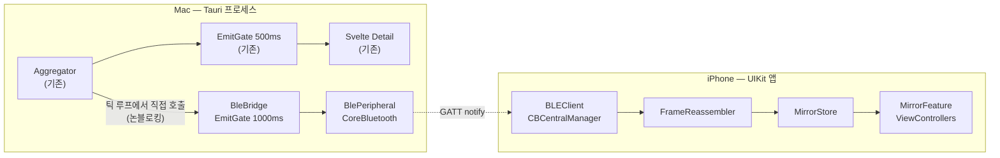

# BLE iOS 미러 — 설계

> AI Agent Monitor(macOS)의 Detail 화면을 BLE로 iOS 클라이언트에 실시간 미러링한다.
> 작성일 2026-08-18 · 대상 버전 v1.3.0

## 1. 목표와 범위

Mac에서 수집·집계한 스냅샷을 BLE로 내보내, iPhone에서 Detail 창과 **같은 화면**을 본다.

**범위 안**
- Mac이 BLE 주변장치(GATT 서버)로 동작해 스냅샷·트리거 목록을 스트리밍
- iOS 앱(UIKit·코드 UI·Tuist)이 central로 접속해 Detail 화면을 미러링
- 6자리 코드 페어링 + 토큰 재접속
- Mac Detail 창에 공유 on/off 토글과 연결 기기 목록

**범위 밖 (의도적 제외)**
- iOS에서의 조작(동기화 버튼·트리거 실행·트리거 편집) — 읽기 전용
- iOS 백그라운드 동작 및 알림 — 포그라운드 미러링만
- 라즈베리파이 클라이언트 — 단, 프로토콜은 BlueZ central이 그대로 붙을 수 있게 설계한다
- Wi-Fi/로컬 네트워크 전송 경로

**성공 기준**
1. iPhone 앱을 열면 3초 안에 Mac에 붙어 스냅샷이 흐른다.
2. 화면이 Detail 창과 시각적으로 일치한다(에이전트 카드·사용량 바·세션 목록·트리거 목록).
3. 페어링하지 않은 기기는 스냅샷을 한 바이트도 받지 못한다.
4. BLE가 꺼져 있거나 실패해도 기존 Mac 앱 동작에 영향이 없다.

## 2. 시스템 구조



기존 코드에 대한 **유일한 침습 지점은 `lib.rs` 스냅샷 틱 루프에 `BleBridge::on_snapshot` 호출 한 줄**이며,
기존 `emit("snapshot")` **뒤에** 놓아 BLE가 실패해도 기존 경로가 먼저 끝나도록 한다.

BLE가 기존 동작에 전이되지 않는 근거는 `on_snapshot`이 **어느 경로로도 블로킹하지 않는다**는 것이다.
꺼져 있거나 구독자가 없으면 즉시 반환하고, 전송은 `offer_frame`이 메인 스레드로 던지는
fire-and-forget이며, 직렬화·청킹은 1KB 수준이라 마이크로초 단위다. 실제 전송과 백프레셔는
메인 스레드가 소유한 송신 큐(4.5)가 책임진다.

> 1단계 계획 수립 중 이 부분을 단순화했다. 당초 `tokio::sync::watch`(latest-wins)로 분기하려 했으나,
> 위 근거로 분리 태스크와 채널이 순수한 추가 비용이라 직접 호출로 대체했다(YAGNI).
> BLE 처리가 무거워지면 3단계에서 도입한다.

## 3. macOS 주변장치 구현 — 스파이크로 결정됨

**결론: `objc2-core-bluetooth` 0.3.2 직접 구현(B안). 0단계 스파이크 완료 (2026-08-18).**

### 3.1 A안 (`ble-peripheral-rust` 0.2.0) — 탈락

소스 검토만으로 이 설계에 부적합함이 드러났다. 근거는 `src/peripheral/corebluetooth/peripheral_manager.rs:195`:

1. **`updateValue:forCharacteristic:onSubscribedCentrals:`에 `None`을 하드코딩**한다 → 구독한 **모든** central에 브로드캐스트. **인가된 기기만 골라 보내는 것이 원천적으로 불가능**해 5장 페어링 요구사항과 정면 충돌한다.
2. **`updateValue`의 `BOOL` 반환값을 버리고 항상 `Ok(())`를 반환**하며, 델리게이트에 **`peripheralManagerIsReadyToUpdateSubscribers:`가 없다** → 전송 큐 포화를 감지할 방법이 전혀 없다. 청크 프레이밍에서는 **무음 패킷 손실 → 영원히 완성되지 않는 프레임**으로 이어진다.
3. `CBCentral.maximumUpdateValueLength`를 노출하지 않아 청크 크기를 하드코딩할 수밖에 없다.

세 결함 모두 크레이트 내부 구조에 기인해 우회할 수 없다.

### 3.2 B안 — 채택, 실행 검증 완료

`objc2` 0.6.4 + `objc2-core-bluetooth` 0.3.2. 필요한 API가 모두 존재함을 확인했다.

| 필요 기능 | API | A안 |
|---|---|---|
| 특정 central 지정 notify | `updateValue_forCharacteristic_onSubscribedCentrals(_, _, Some(&centrals)) -> bool` | 불가 |
| 백프레셔 신호 | 델리게이트 `peripheralManagerIsReadyToUpdateSubscribers:` | 없음 |
| 청크 크기 산출 | `CBCentral::maximumUpdateValueLength()` | 미노출 |
| 읽기/쓰기 응답 | `respondToRequest_withResult` | 있음 |
| 링크 암호화(향후) | `CBAttributePermissions::ReadEncryptionRequired` | 미노출 |

**스파이크 실행 결과** (throwaway 바이너리, macOS 26 / Xcode 26.6 / Swift 6.3.3):

```
[delegate] didUpdateState = CBManagerState(5)      ← PoweredOn
[delegate] didAddService OK ✓
[delegate] didStartAdvertising OK ✓ — 'AIM-spike' 광고 중
```

`define_class!`로 `CBPeripheralManagerDelegate`를 구현하는 방식이 현 툴체인에서 정상 동작한다.
서비스 등록과 광고 시작까지 실제로 성공했다.

**미검증 잔여분**: central이 실제로 구독했을 때의 `maximumUpdateValueLength` 실측값, 타게팅 notify,
백프레셔 콜백. 시뮬레이터에 BLE가 없어 실기기가 필요하다. 세 API 모두 존재·컴파일이 확인됐고
동작은 Apple 구현이므로 리스크는 낮다고 판단해 1단계 착수를 막지 않는다.

### 3.3 폐기된 대안

**C. Swift 사이드카** (Tauri sidecar + stdio JSON-lines) — B안이 검증되어 불필요. 서명·공증 파이프라인에
바이너리를 추가하는 부담과 IPC 홉을 피할 수 있게 됐다. B안이 예상 밖으로 무너질 때만 되돌아온다.

**추상화 경계**: 그래도 `trait BlePeripheral`은 유지한다. 구현 교체 때문이 아니라, **BLE 없이 가짜 구현으로
`BleBridge`를 테스트하기 위해서다**(실기기 의존을 줄이는 것이 이 프로젝트의 주요 개발 비용 절감 수단이다).

```rust
trait BlePeripheral: Send + Sync {
    fn start(&self) -> anyhow::Result<()>;
    fn stop(&self);
    /// 프레임을 넘긴다. 실제 전송과 백프레셔(4.5)는 구현체가 책임진다(fire-and-forget).
    fn offer_frame(&self, ch: CharId, chunks: Vec<Vec<u8>>);
    fn subscribers(&self) -> Vec<Subscriber>;
    /// 모든 구독자가 받을 수 있는 최대 청크 크기. 구독자가 없으면 None.
    fn min_notify_len(&self) -> Option<usize> {
        self.subscribers().iter().map(|s| s.max_notify_len).min()
    }
}

struct Subscriber { id: CentralId, max_notify_len: usize }

enum PeripheralEvent {
    PoweredOn,
    PoweredOff,
    AdvertisingStarted,
    Subscribed(Subscriber),
    Unsubscribed(CentralId),
    Error(String),
}
```

`offer_frame`이 청크 단위가 아니라 **프레임 단위**인 것이 핵심이다. 송신 큐와 백프레셔를 구현체
안(메인 스레드)에 가둬야 `updateValue`의 `bool` 반환을 스레드 왕복 없이 처리할 수 있다.
3단계 페어링에서 쓰기 요청(`Write`)과 읽기 요청 이벤트를 이 enum에 추가한다.

**Windows**: `#[cfg(target_os = "macos")]`로 게이트하고 비-macOS는 no-op 스텁. 기존 MSI 릴리즈가 깨지지 않는다.

## 4. GATT 프로토콜

### 4.1 UUID (확정)

| 항목 | UUID | 속성 |
|---|---|---|
| Service | `07A98A35-16C7-4BBA-A296-E28B78B7E683` | — |
| Info | `F494FC3B-ED50-4561-AADE-1A310C5732E6` | Read |
| Auth | `1403603A-4C78-4899-A2B8-FDA198101900` | Write, Notify |
| Snapshot | `0AE789AA-EF38-4A35-9E72-A7CD7AD995D5` | Notify |
| Triggers | `4F60A8C2-F181-4717-AEE3-07C4D7846597` | Read, Notify |

광고에는 Service UUID와 로컬 이름(`AIM-<호스트명 앞 8자>`)만 싣는다.

### 4.2 프레이밍

BLE notify 페이로드는 iOS 기준 약 182바이트다. 모든 메시지를 청크로 쪼갠다.

```
byte 0   frame_id     u8, 메시지마다 증가(랩어라운드)
byte 1   chunk_idx    u8, 0-based
byte 2   chunk_count  u8, 총 청크 수
byte 3.. payload      UTF-8 JSON 조각
```

청크당 페이로드 = `CBCentral::maximumUpdateValueLength() - 3`. **central마다 값이 다르므로 하드코딩하지 않고
구독 시점에 실측한다**(스파이크에서 이 API의 존재를 확인했다). 최대 메시지 = 255 × 182 ≈ 45KB로 충분하다.

**재조립 규칙** (양쪽 동일):
1. `chunk_idx == 0` → 새 버퍼 시작, `frame_id` 기록
2. `frame_id`가 진행 중인 것과 다름 → 진행 중 버퍼 폐기 후 1번 적용
3. `chunk_idx`가 기대값과 다름 → 해당 프레임 폐기 (중간 구독 시 조각 방어)
4. `chunk_idx == chunk_count - 1` → 완성된 메시지 방출

GATT notify는 연결 내 순서가 보장되지만, 구독 시점이 프레임 중간일 수 있어 3번이 필요하다.

### 4.3 페이로드 DTO

내부 `Snapshot`을 그대로 보내지 않는다. 이유:
- `SystemTime`이 `{secs_since_epoch, nanos_since_epoch}`로 직렬화돼 장황하고 Swift에서 다루기 나쁘다
- BLE 대역이 좁아 짧은 키가 실익이 있다
- 내부 타입이 바뀌어도 프로토콜이 깨지지 않는 계약선이 생긴다

**Info** (Read, 접속 직후 1회)
```json
{"v":1,"host":"wannys-MacBook","app":"1.3.0"}
```
`v`가 클라이언트 지원 범위 밖이면 iOS는 "앱 업데이트 필요" 화면을 띄우고 연결을 끊는다.

**Snapshot** (Notify, 최대 1Hz)
```json
{"v":1,"t":1755500000,
 "a":[{"k":0,"r":123.4,"t5":48210,
       "p5":62.0,"r5":1755512400,"pw":31.5,"rw":1755900000,
       "pj":[{"id":2847193,"n":"4AIAgentMonitor","m":"claude-opus-5",
              "r":98.2,"t":1755499987,"s":0}]}]}
```

| 키 | 원본 | 비고 |
|---|---|---|
| `t` | `emitted_at` | epoch 초(u64). 모든 시각 필드가 u64로 통일된다 |
| `k` | `AgentState.kind` | 0=claude, 1=codex |
| `r` | `rate_tok_per_sec` | |
| `t5` | `tokens_5h` | **`tokens_in + tokens_out` 합만** 보낸다. QuotaBar가 "동기화 전" 표시에만 쓰므로 세부 4필드가 불필요 |
| `p5`/`r5` | `quota_used_pct` / `quota_reset_at` | null 가능 |
| `pw`/`rw` | 주간 사용률 / 리셋 | null 가능 |
| `pj[].id` | `path`의 FNV-1a 해시 하위 32비트 | **전체 경로를 보내지 않는다.** SessionList는 `name`만 표시하고 `path`는 목록 키로만 쓴다. 경로 유출 방지 + 프로젝트당 ~50B 절약. 재시작·버전 간에도 값이 동일해야 하므로 `DefaultHasher`(시드가 불안정)를 쓰지 않고 FNV-1a로 고정한다 |
| `pj[].s` | `status` | 0=active, 1=idle, 2=dormant |

`quota_limit`과 `triggered_by`는 화면에 쓰이지 않아 제외한다.

크기 추정: 프로젝트 1개 ≈ 75B. 에이전트 2 + 프로젝트 10 ≈ **950B ≈ 6패킷**. 1Hz에 여유가 크므로 압축은 넣지 않는다.

**Triggers** (Read + Notify, 변경 시 + 구독 시 1회)
```json
{"v":1,"tr":[{"id":"…","k":0,"c":"0 0 8 * * *","w":"~/dev/foo","p":"ping","e":true}]}
```
매초 재전송을 피하려고 스냅샷과 특성을 분리한다.

### 4.4 전송률 제어

기존 `emitter.rs`의 `EmitGate`를 **그대로 재사용**해 throttle만 1000ms로 둔 인스턴스를 하나 더 만든다.
이미 해시 비교 + 시간 게이트가 검증된 유닛이라 새 코드가 필요 없다.
**인가된 구독자가 0이면 직렬화조차 하지 않는다.**

### 4.5 백프레셔 (스파이크에서 발견 — 필수)

`updateValue:forCharacteristic:onSubscribedCentrals:`는 **`false`를 반환할 수 있다.** 전송 큐가
가득 찼다는 뜻이고, 이때 보낸 청크는 **버려진다.** 반환값을 무시하면 프레임 중간 청크가 조용히 사라져
수신 측이 영원히 프레임을 완성하지 못한다. **A안이 탈락한 결정적 이유이므로 B안 구현에서 반드시 처리한다.**

송신 큐를 둔다:

```
struct SendQueue { pending: VecDeque<Chunk>, paused: bool }

pump():
    while !paused && let Some(c) = pending.front():
        if peripheral.notify(c) == true:  pending.pop_front()
        else:                             paused = true      // 큐 포화
// 델리게이트 peripheralManagerIsReadyToUpdateSubscribers: 수신 시
on_ready():  paused = false; pump()
```

**최신값 우선 정책**: 새 스냅샷이 만들어졌는데 이전 스냅샷 청크가 큐에 남아 있으면,
**남은 청크를 통째로 버리고 새 프레임으로 교체한다.** 지연된 과거 상태를 굳이 전달할 이유가 없고,
큐가 무한히 쌓이는 것을 막아 지연 상한이 보장된다. `frame_id`가 바뀌므로 수신 측 규칙 2번이
불완전한 이전 프레임을 자동으로 폐기한다 — 프레이밍 설계와 정확히 맞물린다.

단, **프레임 중간에서 교체하지 않는다.** 이미 일부 청크를 보낸 프레임은 끝까지 보낸 뒤 교체한다
(수신 측이 부분 프레임을 버리는 비용을 줄이기 위함).

## 5. 페어링과 보안

프로젝트 디렉토리 이름과 AI 사용 패턴이 BLE 도달 범위 안 아무에게나 노출되는 것을 막는다.

### 5.1 상태 기계

```
사용자가 Mac Devices 탭에서 [페어링 시작] 클릭
   → 6자리 코드 생성, Detail 창 표시, 120초 유효 = "페어링 창"
   → 이 창 하나당 시도 5회 (코드당이 아니다)

[미인가] --write(HELLO)--> 창이 열려 있으면 [코드 대기], 없으면 거부
   notify(Auth){"ok":false,"await":"code"}  ← 코드 자체는 절대 보내지 않는다
[코드 대기] --write(CODE:123456)--> 검증
   성공 → 128비트 토큰 발급, notify(Auth){"ok":true,"token":"…"} → [인가]
   실패 → notify(Auth){"ok":false,"left":n}, 5회 소진 시 창 폐기
[미인가] --write(AUTH)--------> Mac: 128비트 논스 생성
   notify(Auth){"ok":false,"nonce":"<hex>"}
[논스 수신] --write(PROOF:<hmac-hex>)--> 검증
   HMAC-SHA256(key=토큰, msg=논스) 비교 → 일치하면 [인가]
   불일치 → notify(Auth){"ok":false}, 논스 폐기
```

> **토큰은 발급 시 1회만 링크를 탄다.** 재연결 인증에 토큰을 그대로 보내면 근접 스니핑 한 번으로
> 영구 접근권이 넘어간다. 대신 Mac이 매번 새 논스를 보내고 클라이언트가 토큰으로 서명해 답한다 —
> 도청자는 논스와 서명만 보므로 토큰을 복원할 수 없고, 논스가 1회용이라 재생 공격도 막힌다.
> 논스는 발급 후 30초 유효, 1회 사용 후 폐기.

> **코드 발급이 사용자 제스처를 요구하는 이유.** 초안은 `HELLO` 가 코드를 발급하게 했는데, 그러면 시도 5회 제한이 무의미해진다. `HELLO` 는 공짜이고 횟수 제한이 없으므로 공격자가
> `반복 { HELLO 로 예산 리셋 ; 5회 추측 }` 로 100만 조합을 소진할 수 있다 — BLE write 속도
> 기준 **약 9시간**이다. 시도 예산을 코드가 아니라 **사용자가 연 창**에 묶어야 그 근거가 성립한다.
> 부수적으로, 공격자가 `HELLO` 를 연발해 정당한 사용자의 코드를 계속 폐기하고 Mac 화면에
> 자기 코드를 띄우는 방해도 함께 막힌다.

> **창에는 소유자가 없다.** 창이 열려 있는 동안에는 어느 central 이든 `CODE:` 를 제출할 수 있고,
> 시도 5회는 **창 전체가 공유**한다. 첫 `HELLO` 를 보낸 central 에게 창을 묶는 설계도 검토했으나
> 채택하지 않았다 — 공격자가 `HELLO` 한 번으로 시도를 단 1회도 쓰지 않고 창을 조용히 죽일 수 있고,
> 사람이 코드를 입력하는 속도로는 재선점 경쟁에서 이길 수 없다. 소유자를 두지 않으면 방해에
> 최소 5회의 실패한 추측이 들고, 그 소진이 Mac 화면에 그대로 보인다.
>
> 창이 닫히는 경우는 셋이다: 코드 성공, 시도 5회 소진, 120초 만료. 소진·만료로 닫혔을 때 Mac 은
> 그 이유를 표시해 사용자가 방해를 방해로 알아볼 수 있게 한다.

`[인가]` 상태의 central에만 Snapshot·Triggers notify를 보낸다.

**토큰 폐기는 살아 있는 세션까지 닿는다.** 언페어링은 저장된 토큰을 지우는 데서 끝나지 않는다 —
그 토큰으로 인가된 central 의 세션 인가도 함께 내려야 실제로 데이터가 끊긴다. 그래서 인가 상태는
`central → 그 central 을 인가시킨 토큰` 으로 기록한다.

### 5.2 결정과 근거

- **애플리케이션 레벨 인증을 쓰고 CoreBluetooth 암호화 속성(`readEncryptionRequired`)에 기대지 않는다.** 크레이트의 지원 여부가 불확실하고, A→B→C 어느 구현으로 가도 동일하게 동작해야 하기 때문이다.
- **코드 유효 120초, 창당 시도 5회.** 6자리 무차별 대입(100만 조합)을 실질적으로 차단한다. 이 근거는
  **시도 예산이 사용자가 연 창에 묶여 있을 때만** 성립한다 — 코드에 묶으면 재발급으로 예산이 리셋돼
  무의미해진다(5.1의 상자 참고).
- **기본값 off.** 사용자가 Detail 창에서 명시적으로 켜야 광고를 시작한다.
- 토큰 저장: Mac은 `~/.config/ai-agent-monitor/ble-peers.json`(기존 설정 규약과 동일), iOS는 Keychain.

**한계(명시)**: BLE 링크 자체는 암호화하지 않으므로, 인가된 세션의 트래픽은 근접 스니핑에 노출될 수 있다. 전달 데이터가 토큰 사용률과 프로젝트 이름 수준이고 자격증명을 포함하지 않는다는 판단하에 수용한다. 링크 암호화가 필요해지면 B안 구현에서 `CBAttributePermissions`로 승격한다.

> **정정(3단계에서 드러남)**: 위 "자격증명을 포함하지 않는다"는 페어링 도입 전의 서술이다. 128비트
> 토큰은 영구 자격증명이므로, 그것이 매 재연결마다 평문으로 오가면 스니핑 1회에 지속적 접근권이
> 넘어간다. 그래서 재인증을 **챌린지-응답(HMAC-SHA256)** 으로 설계했다(5.1) — 토큰은 발급 시
> 1회만 링크를 타고, 이후에는 논스와 서명만 오간다.
>
> 남는 노출은 두 가지다. ① **발급 시 1회** 토큰이 평문으로 지나간다. 그 순간 도청 중이던
> 공격자는 토큰을 얻는다 — 사용자가 직접 [페어링 시작]을 누른 120초 창 안에서만 가능하다.
> ② **스냅샷 본문**은 계속 평문이므로 근접 도청자는 사용률과 프로젝트 이름을 볼 수 있다.
> ③ **능동 중계(MITM)**. 챌린지-응답은 수동 도청자에게서 토큰을 지키지만, 양쪽 사이에 끼어드는
> 공격자는 막지 못한다 — 가짜 주변장치로 진짜 iPhone 을 붙잡고, Mac 에게서 받은 논스를 그대로
> 넘겨 iPhone 이 서명하게 한 뒤 그 서명을 Mac 에 되돌리면 인가를 통과한다. 서명이 링크에
> 묶여 있지 않기 때문이며, 이는 챌린지-응답 설계의 결함이 아니라 링크 인증이 없다는 사실의
> 결과다. 셋 모두 링크 암호화 없이는 닫히지 않으며, 원래의 수용 판단이 그대로 적용된다.

### 5.3 macOS 권한

현재 저장소에 plist·entitlements 파일이 없다. 신규 추가한다.

- `src-tauri/Info.plist` — `NSBluetoothAlwaysUsageDescription` (Tauri 2가 자동 병합)
- 이 문자열이 없으면 **공증된 빌드가 첫 CoreBluetooth 호출에서 즉시 종료된다.**
- 현재 빌드는 샌드박스가 아니므로 `com.apple.security.device.bluetooth` 엔타이틀먼트는 불필요하다. 샌드박스로 전환하면 함께 추가한다.

## 6. Mac 쪽 구성

```
src-tauri/src/ble/
  mod.rs         BleBridge — 게이트, 직렬화, 청킹, 인가 관리
  peripheral.rs  trait BlePeripheral + macOS 구현 (A안, 실패 시 B안)
  wire.rs        DTO + From<&Snapshot>
  framing.rs     청커
  pairing.rs     코드 생성·토큰 발급/검증·ble-peers.json 영속화
  stub.rs        #[cfg(not(target_os = "macos"))] no-op
```

**신규 Tauri command** (프→백)
| 명령 | 반환 | 용도 |
|---|---|---|
| `ble_status()` | `BleStatus` | 활성 여부·광고 여부·연결 기기 목록·표시 중인 페어링 코드 |
| `ble_set_enabled(bool)` | `()` | 공유 on/off |
| `ble_unpair(peer_id)` | `()` | 기기 연결 해제 및 토큰 폐기 |
| `ble_unpair_all()` | `()` | 모든 기기 해제 |
| `ble_begin_pairing()` | `()` | 6자리 코드 발급(사용자 제스처 전용, 5.1) |

> **`peer_id` 는 `CBCentral.identifier` 가 아니다.** 3단계에서 확정한다.
> iOS 기기는 프라이버시를 위해 BLE 주소를 주기적으로 바꾸고, 링크 계층 본딩을 하지 않는 이
> 설계에서는 CoreBluetooth 가 재연결 사이에 같은 central 을 같은 식별자로 준다는 보장이 없다.
> 그래서 영속 키로 쓸 수 없다.
>
> 대신 **토큰이 곧 기기의 정체성**이다. `peer_id` 는 `hex(SHA-256(토큰))[..8]` 로 파생한다 —
> 토큰당 하나로 안정적이고, 프론트엔드에 토큰 자체를 넘기지 않는다. 폐기는 `peer_id` → 토큰
> 해석을 `PairingManager` 안에서만 하고, 토큰은 모듈 밖으로 나가지 않는다.
>
> `CBCentral.identifier` 는 **연결 단위 세션 키로만** 쓴다(인가 맵, 구독자 목록). 재연결 때
> 값이 바뀌어도 무해하다 — 인가는 어차피 연결이 끊기면 사라지고, 재인증은 토큰 서명으로 한다.

**신규 이벤트** (백→프): `ble_status` — 페어링 코드와 연결 상태를 Detail 창에 실시간 반영.

**Detail 창 UI**: 기존 탭 바에 **`Devices` 탭**을 추가한다(현재 Sessions/Triggers 2개).
탭 자체는 1단계에서 공유 토글만 담아 도입하고, 페어링 코드 표시와 연결 기기 목록·해제 버튼은 3단계에서 채운다.

기기 목록의 각 행은 `peer_id` 앞 8자, 페어링 시각, 그리고 지금 붙어 있으면 `연결됨` 표시를
담는다. 기기 이름은 넣지 않는다 — 그러려면 페어링 교환에 클라이언트가 정한 문자열을 실어야
하는데, 읽기 전용 미러에 기기가 한둘인 상황에서 얻는 것보다 신뢰 경계가 넓어지는 비용이 크다.

페어링 창이 닫힌 이유도 이 탭에 표시한다. 만료와 **시도 5회 소진**은 구분해서 보여준다 —
소진이 보인다는 것이 창에 소유자를 두지 않기로 한 근거의 절반이기 때문이다(5.1).

## 7. iOS 앱 구성

`ios/` 서브폴더. UIKit · 코드 기반 UI(SnapKit) · Tuist. 배포 타깃 **iOS 17.0**.

### 7.1 Tuist 모듈 그래프

```
App  ──►  MirrorFeature  ──►  MirrorCore  ──►  BLETransport  ──►  Wire
                │                                                  ▲
                └──────────►  DesignSystem                         │
                                                     (Wire는 의존성 0)
```

| 모듈 | 책임 | 의존 | 테스트 방법 |
|---|---|---|---|
| `Wire` | Codable DTO (Rust `wire.rs` 미러) | **없음** | 골든 벡터 디코딩 |
| `BLETransport` | `CBCentralManager` 래퍼, `FrameReassembler`, `PairingClient` | Wire, CoreBluetooth | `FrameReassembler`는 순수 함수라 BLE 없이 테스트 |
| `MirrorCore` | `MirrorStore`, 연결 상태 기계 | Wire, BLETransport | 전송 계층을 프로토콜로 추상화해 가짜 구현으로 테스트 |
| `DesignSystem` | 색·타이포·`QuotaBarView`·`StatusDotView` | SnapKit | SnapshotTesting 후보(현재 범위 밖) |
| `MirrorFeature` | `AgentCardVC`·`SessionListVC`·`TriggerListVC`·`PairingVC` | MirrorCore, DesignSystem, SnapKit | — |
| `App` | 조립·DI·`SceneDelegate` | MirrorFeature | — |

`Wire`가 의존성 0인 것이 핵심이다. Rust와 공유하는 골든 벡터를 실기기·시뮬레이터 없이 검증할 수 있다.

### 7.2 상태 전파

UIKit이므로 Combine `CurrentValueSubject`로 `MirrorStore`의 상태를 흘린다. SwiftUI의 `@Observable` 대신
Combine을 쓰는 이유는 UIKit 바인딩에서 의식(ceremony)이 가장 적고 성숙하기 때문이다.

Swift 6 엄격 동시성: `CBCentralManagerDelegate` 콜백이 지정 큐에서 오므로 `BLEClient`를 `@MainActor`로
고정하고, 파싱만 백그라운드 태스크로 뺀다.

### 7.3 연결 상태 기계 (UI에 항상 노출)

```
idle → scanning → connecting → readingInfo → authenticating → streaming
                                                    │
                                       needsPairing ┘
  ← disconnected(사유)
```

화면이 안 뜰 때 원인이 미궁이 되지 않도록 현재 상태와 사유를 상단에 항상 표시한다.

### 7.4 화면 대응

Svelte 컴포넌트와 1:1로 옮긴다. 색·임계치·문구를 그대로 쓴다.

| Svelte | iOS | 이식 대상 |
|---|---|---|
| `AgentCard.svelte` | `AgentCardView` | 상태 점(claude `#30d158` / codex `#ff9f0a`), tok/s 대형 표기, 대표 프로젝트·모델 |
| `QuotaBar.svelte` | `QuotaBarView` | 5h/주간 2단 바, 임계 그라디언트 70%·90%, "동기화 전" 폴백 |
| `SessionList.svelte` | `SessionListVC` | 최근 활동순 정렬, 상태별 점 색(dormant `#636366`), rate `#0a84ff` |
| `TriggerList.svelte` | `TriggerListVC` | 목록만 (조작 없음) |

**카운트다운은 지금도 프론트가 `quota_reset_at` epoch에서 계산**하므로 iOS도 동일하게 1초 타이머로
계산한다. 추가 전송이 없다. 문구도 "약 X시간 Y분 Z초 남음" / "리셋됨"을 그대로 쓴다.

## 8. 테스트 전략

**Rust**
- `Snapshot → MirrorSnapshot` 매핑 (null 처리, 프로젝트 id 안정성)
- 청커: 경계값(빈 메시지, 정확히 1청크, 청크 경계 ±1)
- `BleGate` throttle — 기존 `emitter.rs` 테스트 4개 패턴을 그대로 따름
- 페어링: 코드 만료, 시도 소진, 토큰 검증

**Swift**
- `Wire` 디코딩
- `FrameReassembler` — 정상·프레임 전환·순서 이탈·중간 구독

**교차 검증 (가장 중요)**
청킹/재조립은 이 프로젝트에서 **가장 버그가 나기 쉬운 지점**이고 두 언어에 나뉘어 있다.
저장소에 골든 벡터를 두고 **Rust 테스트와 Swift 테스트가 같은 파일**을 읽는다.

```
docs/ble-protocol/golden/
  snapshot-sample.json   대표 Snapshot의 DTO 형태
  frames-sample.json     { "chunk_size": 182, "message": "...", "frames": ["0x…", …] }
```

언어 간 프레이밍 불일치를 실기기 없이 잡는 것이 목적이다.

**실기기**
BLE는 시뮬레이터에서 동작하지 않는다. 페어링·재연결·범위 이탈·백그라운드 복귀는 실기기 수동 확인이 필수다.

## 9. 단계 분할

| 단계 | 산출물 | 완료 판정 |
|---|---|---|
| **0. 스파이크** ✅ **완료 2026-08-18** | objc2로 GATT 서비스 등록 + 광고 성공 확인 | **A안 탈락, B안 채택** (3장). 코드는 버렸다 |
| **1. 전송 계층** | `wire.rs`·`framing.rs`·`send_queue.rs`·`BleBridge`·골든 벡터. Tuist 스캐폴딩 + `Wire`·`BLETransport`. iOS는 raw JSON 덤프 화면. Mac에 `Devices` 탭 + 공유 토글(기본 off) | 실기기에서 스냅샷 JSON이 1Hz로 흐른다 |
| **2. iOS UI** | `DesignSystem`·`MirrorFeature`. Detail 화면 미러링 완성 | Detail 창과 나란히 놓고 시각적으로 일치 |
| **3. 페어링** | `pairing.rs`·`Devices` 탭·iOS 페어링 화면·Keychain | 페어링 안 한 기기가 스냅샷을 못 받는다 |

단계마다 독립적으로 쓸모가 있어 어디서 멈춰도 낭비가 없다.
**1단계에서 공유 토글을 기본 off로 넣는 이유는 3단계 전까지 인증 없는 상태가 실수로 켜지지 않게 하기 위함이다.**

## 10. 리스크

| 리스크 | 영향 | 대응 |
|---|---|---|
| ~~`ble-peripheral-rust` 오작동~~ | — | **해소.** 스파이크에서 탈락 판정, B안 채택 (3장) |
| `updateValue` 큐 포화로 청크 유실 | 프레임이 완성되지 않아 화면이 멈춤 | 4.5 송신 큐 + `isReadyToUpdateSubscribers` 처리. **구현 필수 항목** |
| 실기기 `maximumUpdateValueLength`가 예상보다 작음 | 청크 수 증가(성능만 영향) | 구독 시점 실측이라 자동 적응. 기능 영향 없음 |
| macOS Bluetooth 권한 누락 | 공증 빌드가 첫 호출에서 종료 | `Info.plist` 추가를 1단계 필수 항목으로 고정 |
| 언어 간 프레이밍 불일치 | 실기기에서만 드러나는 난해한 버그 | 골든 벡터 교차 테스트 |
| BLE 실기기 의존으로 개발 루프 느림 | 반복 속도 저하 | `Wire`·`FrameReassembler`·`framing.rs`를 순수 유닛으로 분리해 대부분을 실기기 없이 검증 |
| BLE 처리 지연이 본 앱에 전이 | 기존 기능 회귀 | `on_snapshot`이 논블로킹(2장). 전송은 메인 스레드 송신 큐가 fire-and-forget 으로 처리 |
