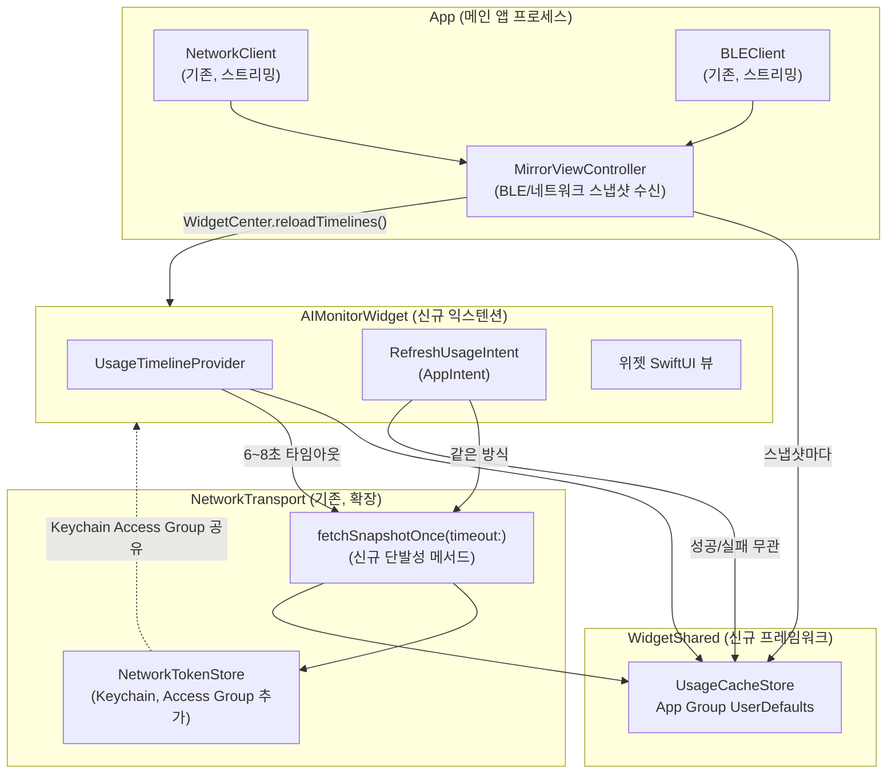

# iOS 홈 화면 위젯 — 설계

> Mac AI Agent Monitor의 tok/s·쿼터 사용량을 iOS 홈 화면 위젯으로 보여준다.
> 작성일 2026-09-17 · 대상: `App`(NETWORK_TRANSPORT) 타겟만, 빌드 3 이후


## 최종 레이아웃 정리 (2026-09-17)

아래 본문은 최초 기능 설계 기록이며, 위젯 표시 방식은 사용자 확인을 거쳐 다음과 같이 확정했다.

- Small은 에이전트별 주간(Week) 사용량을 세로로 배치한다. Medium/Large는 에이전트를 가로로 배치하고 5h·Week 행을 표시한다. 에이전트 정렬과 사용량 계산은 기존 로직을 유지한다.
- 카드 내용은 이름 → 주간 리셋까지 남은 시간 → 사용량 순서로 위에서부터 쌓는다. 남은 시간이 없을 때도 동일한 한 줄을 비워 두어 그래프 위치를 유지한다.
- 카드 내부 간격은 기본 8pt다. Small은 높이가 부족하면 간격과 글자 크기를 단계적으로 줄인다. 에이전트 사이에는 구분선과 총 10~12pt의 여백을 두어 카드 내부 간격보다 넓게 구분한다.
- 시스템 콘텐츠 여백은 끄고 뷰에서 상단·좌우 16pt, 하단 24pt를 한 번만 적용한다. 남는 높이는 콘텐츠 아래에 남긴다.
- 상단 갱신 경과 시간은 새로고침 버튼 왼쪽에 우측 정렬한다. 동적 날짜 텍스트에도 trailing 정렬을 명시한다.
- 사용량을 지원하지 않거나 조회에 실패한 행도 막대 자리를 비워 두어 양쪽 열의 높이를 맞춘다.

검증: AIMonitorWidget 스킴과 포함 앱의 시뮬레이터 빌드 성공. 임시 SwiftUI 렌더링 호스트에서 Small(158/170pt), Medium(338×158/364×170pt), 남은 시간 유무·조회 오류 상태를 확인했다. 이는 실제 WidgetKit 홈 화면의 자동 갱신 스케줄 검증을 대신하지 않는다.

## 1. 목표와 범위

앱을 열지 않아도 홈 화면에서 사용량을 한눈에 보고, 필요하면 그 자리에서 새로고침한다.
실시간 스트리밍은 필요 없다 — 스냅샷 값만 정확하고 신선도를 알 수 있으면 된다.

**범위 안**
- 홈 화면 위젯(Small/Medium/Large), `App` 타겟에만 추가(`AppBLE`는 이번 스코프 밖)
- App Group 캐시: 메인 앱이 BLE/네트워크로 스냅샷을 받을 때마다 즉시 캐시에 반영 + 위젯 리로드
- 위젯 자체의 짧은 타임아웃 네트워크(iroh) 새로고침(자동 스케줄 + 수동 버튼)
- 신선도 표시("N분 전" 등)

**범위 밖 (의도적 제외)**
- `AppBLE` 타겟에 위젯 추가 — iroh 자체가 없어 위젯 자체 새로고침이 불가능하고, 필요해지면 캐시-only 패턴으로 나중에 추가
- 잠금화면(Lock Screen) 위젯 — 색상 제약(단색)과 별도 패밀리(`accessoryCircular` 등)라 추가 작업량, v2로 보류
- 위젯 안에서 최초 페어링(QR 스캔) — 카메라 UI가 필요해 위젯 구조에 안 맞음. 위젯은 메인 앱이 이미 페어링을 마친 뒤에만 의미가 있다
- `BLEClient`의 순수 인증 로직을 CoreBluetooth 비의존 모듈로 분리하는 리팩터링 — §6에서 트레이드오프로만 남기고 이번엔 안 함(YAGNI)

**성공 기준**
1. 메인 앱을 최근에 한 번이라도 열었으면(BLE든 네트워크든 스냅샷을 받은 적 있으면), 앱을 안 열어도 위젯에 그 값이 보인다.
2. 네트워크로 페어링된 상태면, 위젯의 수동 새로고침 버튼을 눌렀을 때 8초 안에 최신값 또는 "새로고침 실패" 중 하나로 반드시 끝난다(무한 대기 없음). 내부 fetch 타임아웃을 7초로 잡아 캐시 반영·UI 갱신 여유를 1초 남긴다(§3.2).
3. 자동 새로고침이 iOS 스케줄러에 의해 뜸하게(또는 전혀) 실행되지 않아도, 캐시값 + 신선도 문구로 사용자가 "얼마나 오래된 값인지" 항상 알 수 있다.
4. 한 번도 페어링한 적 없으면 위젯은 명확한 빈 상태("앱에서 먼저 연결하세요")를 보여준다 — 빈 카드나 크래시 아님.

## 2. 시스템 구조



## 3. 신규/변경 컴포넌트

### 3.1 `WidgetShared` (신규 프레임워크 타겟)

`Wire`(MirrorSnapshot 타입)에만 의존한다 — BLE·네트워크·UI 의존성 없음. App과 Widget 확장 양쪽이 이 모듈 하나로만 캐시를 주고받는다.

```swift
public struct UsageCacheStore {
    public static func save(_ snapshot: MirrorSnapshot, fetchedAt: Date)
    public static func load() -> (snapshot: MirrorSnapshot, fetchedAt: Date)?
}
```

내부적으로 `UserDefaults(suiteName: "group.co.kr.wannypark.aiagentmirror")`에 스냅샷을 JSON(Data)으로,
`fetchedAt`을 `TimeInterval`로 같이 저장한다. 두 값을 한 트랜잭션처럼 같이 쓰고 같이 읽어야
"새 스냅샷인데 옛날 시각" 같은 불일치가 안 생긴다 — 하나의 키에 `{snapshot, fetchedAt}`을 함께
인코딩한 단일 구조체로 저장한다.

### 3.2 `NetworkTransport.fetchSnapshotOnce(timeout:)` (기존 모듈에 메서드 추가)

`NetworkClient.runConnection()`은 무한 스트리밍을 전제로 한다(연결 유지, 실패 시 3초 후 재시도).
위젯은 "한 번 dial → 인증 → 스냅샷 한 장 받고 끊기"만 필요하다. 기존 `authenticate(conn:code:)`는
그대로 재사용하고(가장 까다로운 로직이라 중복 구현하지 않는다), 이후 무한 루프인
`listenForSnapshots` 대신 스트림에서 **첫 유효 프레임 하나만** 읽고 연결을 닫는 새 경로를 추가한다.
전체를 `withThrowingTaskGroup`(또는 `Task.race`류)으로 감싸 `timeout` 초 안에 안 끝나면
`CancellationError`로 정리한다.

```swift
extension NetworkClient {
    /// 위젯 전용. 저장된 페어링 정보로 짧게 한 번만 dial→인증→스냅샷 1장 수신 후 끊는다.
    /// 스트리밍(runConnection)과 달리 재시도하지 않는다 — 실패하면 그대로 던진다,
    /// 호출부(TimelineProvider/AppIntent)가 캐시 폴백을 결정한다.
    public static func fetchSnapshotOnce(timeout: Duration) async throws -> MirrorSnapshot
}
```

### 3.3 `NetworkTokenStore` — Keychain Access Group 추가

현재 각 Keychain 쿼리(`baseQuery(account:)`)에 `kSecAttrAccessGroup`이 없다 — 기본값은 앱 자신의
번들 id 기반 그룹이라 익스텐션과 자동으로 안 섞인다. App/Widget 양쪽 타겟에 **Keychain Sharing**
capability를 추가하고 같은 access group(`$(AppIdentifierPrefix)co.kr.wannypark.aiagentmirror.shared`)을
등록한 뒤, `baseQuery`에 `kSecAttrAccessGroup: accessGroup`을 추가한다. 이 변경은 **App에도** 적용되므로
기존 페어링 토큰이 있는 사용자는 이 업데이트 이후 한 번 재페어링이 필요할 수 있다(Access Group이
바뀌면 기존 Keychain 항목을 못 찾는다 — TokenStore.swift 리네임 때 이미 겪은 것과 같은 종류의 일회성 비용).

### 3.4 `AIMonitorWidget` (신규 위젯 익스텐션 타겟)

- `UsageTimelineProvider`: `placeholder`/`getSnapshot`은 캐시를 즉시 반환(없으면 빈 상태).
  `getTimeline`은: 캐시 로드 → `fetchSnapshotOnce(timeout: .seconds(7))` 시도 → 성공하면 캐시 갱신 후
  그 값으로, 실패하면 기존 캐시값 + `fetchedAt`으로 엔트리 하나 생성 → `Timeline(policy: .after(now+15분))`.
- `RefreshUsageIntent: AppIntent`: `perform()`에서 같은 `fetchSnapshotOnce` 호출, 결과와 무관하게
  `WidgetCenter.shared.reloadTimelines(ofKind:)`로 마무리.
- 위젯 뷰(SwiftUI): Small=대표 에이전트 1개, Medium/Large=전체 에이전트 요약. "대표"는 새로
  선택 알고리즘을 만들지 않고 `MirrorViewController.orderedForDisplay`와 같은 순서(claude → codex →
  그 외, 스냅샷 순서)의 첫 번째를 그대로 쓴다. 각
  크기 모두 우상단에 새로고침 버튼(`Button(intent:)`) + 좌상단/하단에 "N분 전" 신선도 라벨.
- Info.plist: `NSBluetoothAlwaysUsageDescription`을 (미사용이지만) 선언 — §6 참고.

### 3.5 `MirrorViewController` — 캐시 쓰기 훅

`bind(to:)`의 스냅샷 sink(`transport.snapshots.sink { snap in ... }`)에 한 줄 추가:
`UsageCacheStore.save(snap, fetchedAt: Date())` 다음 `WidgetCenter.shared.reloadTimelines(ofKind:)`.
BLE 경로든 네트워크 경로든 이 sink는 공용이라 전송 종류를 가리지 않고 항상 캐시가 갱신된다.

## 4. 에러/빈 상태

| 상황 | 위젯 표시 |
|---|---|
| 캐시 없음(한 번도 페어링/수신 안 됨) | "Mac 앱에서 먼저 연결하세요" + 앱 열기 링크(`widgetURL`) |
| 캐시 있음, 위젯 자체 fetch 실패/타임아웃 | 캐시값 + "N분 전 · 새로고침 실패" |
| 캐시 있음, fetch 성공 | 새 값 + "방금 갱신" |
| 페어링 토큰이 위젯에서 안 읽힘(Access Group 배선 실수 등) | fetch 실패와 동일하게 처리(캐시 폴백) — 위젯이 별도로 "권한 문제"를 구분해 보여주진 않는다, 과도한 세분화라 YAGNI |

## 5. 테스트 계획

- `WidgetShared`: 순수 로직(인코딩/디코딩, 저장/로드 왕복)은 유닛 테스트로 — 기존 `MirrorFormatTests`/`WireTests` 패턴과 동일하게 실제 App Group 없이 `UserDefaults(suiteName:)`를 테스트에서도 그대로 쓸 수 있다(시뮬레이터/테스트 러너에서 App Group 접근이 일반 suite처럼 동작 — 별도 목이 필요 없다).
- `fetchSnapshotOnce`: 기존 `NetworkTransportTests`에 골든 데이터 기반으로 "정상 응답 시 스냅샷 1장 반환", "타임아웃 시 CancellationError" 두 케이스 추가.
- 위젯 자체(TimelineProvider/AppIntent)는 UI 익스텐션이라 호스트 없는 로직 테스트가 어렵다 — `MirrorViewController`가 이미 쓰는 패턴처럼, "캐시 히트/미스 → 어떤 Timeline을 만드는가"라는 **결정 로직만** 순수 함수로 뽑아 테스트하고 실제 `Timeline`/`WidgetCenter` 호출은 얇게 감싼다.
- 실기 검증: 시뮬레이터는 위젯 실제 새로고침 스케줄링을 신뢰성 있게 재현 못 하므로(배터리/사용 패턴 휴리스틱), 실기에서 페어링 → 앱 종료 → 홈 화면에 위젯 추가 → 수동 새로고침 버튼 확인이 필수.

## 6. 알려진 트레이드오프 — Bluetooth 심볼이 위젯 바이너리에 딸려옴

`NetworkTransport`가 `BLEClient.decideV2`/`initialSend`(순수 함수, v2 인증 상태기계)를 재사용하는데,
이 함수들은 `BLEClient.swift` 안에 CoreBluetooth 의존 코드와 **같은 파일·같은 타겟**에 있다. Swift는
타겟(프레임워크) 단위로 링크하므로, 위젯이 `NetworkTransport → BLETransport`를 의존하는 순간 실제로
쓰지도 않는 CoreBluetooth API 심볼이 위젯 바이너리에도 포함된다 — `AppBLE`가 카메라 API 때문에
`ITMS-90683`을 받았던 것과 정확히 같은 메커니즘이다. 같은 해법(미사용 권한 문구를 미리 선언)으로
막아둔다. 근본적으로 고치려면 `decideV2`/`initialSend`/`V2Verb`/`V2Action` 같은 순수 상태기계를
CoreBluetooth 비의존 별도 모듈로 뽑아 `BLETransport`/`NetworkTransport`/위젯이 공통으로 그 모듈만
의존하게 바꿔야 한다 — 맞는 방향이지만 이번 스코프에서는 하지 않는다(YAGNI, 위젯 하나 추가하려고
기존 세 모듈의 의존 구조를 재배선할 이유가 아직 없다). 위젯이 늘어나거나 이 경고가 반복되면 그때 한다.

## 7. 엔타이틀먼트 변경 요약

| 타겟 | 추가 capability |
|---|---|
| `App` | App Groups(`group.co.kr.wannypark.aiagentmirror`), Keychain Sharing(공유 access group) |
| `AIMonitorWidget`(신규) | 위와 동일 두 개 |

`AppBLE`/`MirrorFeatureBLE`는 이번 스코프 밖이라 변경 없음.
